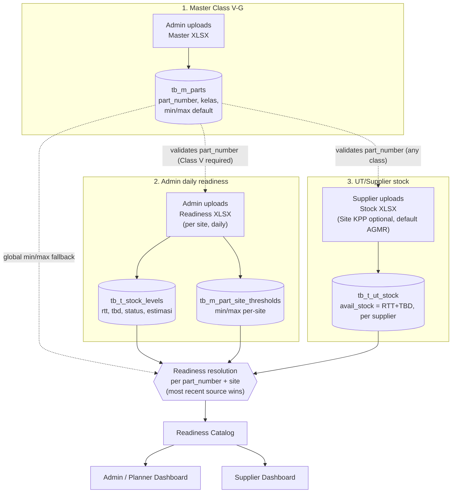

# UT STOCK — KPP Mining Spare-Part Readiness System

A spare-part readiness system for KPP mining sites (Asam-Asam/**AGMR**, Rantau/**RANT**,
Sputra Banjarmasin/**SPUT**), whose parts are supplied by heavy-equipment vendor(s) — currently
**UT (United Tractors)**. It merges two independent stock-upload sources into one per-part,
per-site readiness view, plus an ad-hoc part-request flow (Inquiry) and an overhaul-planning
flow (Scheduled Plan).

Stack: FastAPI + SQLAlchemy (async) + PostgreSQL + Alembic on the backend
(`backend/`); Next.js (App Router) + TypeScript + Tailwind + SWR + next-intl (EN/ID) on the
frontend (`frontend/`). API is served under `/v1`; routers: `auth`, `dashboard`, `parts`,
`inquiries`, `upload` (UT/Supplier), `admin_stock_upload`, `users`, `employees`, `export`,
`master`, `templates`, `sites`, `ho`, `scheduled_plans`.

---

## Stakeholders & Roles

Six system roles (`backend/app/core/rbac.py`). Permissions live in the DB
(`tb_m_role_permissions`), not hardcoded — HO can regrant a role's permissions without a
deploy, and the sidebar menu (`frontend/lib/nav.ts`) reacts automatically since it's driven
purely by permission checks, never role-name comparisons.

| Role | Who they are | Login | What they do |
|---|---|---|---|
| **super_admin** | KPP Head Office — system owner | email + password | Full access: manage all users, sites, roles/permissions, supplier accounts & site assignment |
| **admin** | KPP site admin, one account per site (AGMR/RANT/SPUT) | email + password | Upload daily readiness for their own site, manage the Class V/G master, manage that site's employees & user accounts, view all inquiries (read-only), create/manage Scheduled Plan events & baseline, view achievement |
| **planner** | Site planning staff (often the same person also holds Group Leader — "GL-Planner") | NRP, no password | Submit & approve/reject inquiries for their site, upload into existing Scheduled Plan events, revise `req_date` |
| **group_leader** | Field team lead | NRP, no password | Submit Class G inquiries for their team |
| **user** | Field mechanic / operator | NRP, no password | Submit Class G inquiries |
| **supplier** | External vendor PIC — today, a single account "PIC UT United Tractors" (`site="ALL"`) | email + password | Upload stock to any site they're assigned to, manage their own plant-site mapping, respond to inquiry items, fill Scheduled Plan part readiness, view readiness across all sites |

Notes:
- **Multi-supplier is supported by design**, even though only one supplier (UT) is seeded today.
  HO can onboard another vendor via `/ho/suppliers`; each supplier's uploads, plant-mapping, and
  upload history are scoped independently and never clash with another supplier's data for the
  same site.
- Field-staff roles (`user`/`group_leader`/`planner`) are scoped to one `site`; `admin` is pinned
  to one site too; `supplier` and `super_admin` are typically `site="ALL"`.

---

## Master Data

- **Site** (`tb_m_sites`): AGMR (Asam-Asam Mine), RANT (Rantau Warehouse), SPUT (Sputra
  Banjarmasin).
- **Part** (`tb_m_parts`): `kelas` (DB column `class`) is **V** (Vital — monitored automatically
  via the daily readiness uploads below) or **G** (General — not stocked by default, requested
  ad-hoc via Inquiry). `superseded_by` chains a part to its replacement PN, followed during
  upload resolution.
- **Supplier ↔ Site** (`tb_t_supplier_sites`): which sites a given supplier is allowed to serve,
  managed by HO.
- **Plant-Site Mapping** (`tb_m_plant_site_mapping`): a per-supplier `(plnt_code, site_code)`
  allow-list. The CRUD for it exists (HO modal + supplier self-service page), but it is **not**
  currently enforced by the UT stock upload (see below) — kept for when multi-plant-per-site
  support is actually needed.

---

## Getting Started

### 0. Environment files (first time only)

```
cp .env.prod.example .env.prod
cp frontend/.env.local.example frontend/.env.local
```

Fill in `.env.prod` — at minimum `POSTGRES_USER` / `POSTGRES_PASSWORD` / `POSTGRES_DB` /
`DATABASE_URL` (must match the Postgres credentials) and `JWT_SECRET_KEY` (generate with
`python -c "import secrets; print(secrets.token_hex(32))"`).

### Option 1: Docker (easiest — runs Postgres + backend together)

```
docker compose -f docker-compose.prod.yml --env-file .env.prod up --build
```

`--env-file .env.prod` is required — the compose file's `${POSTGRES_USER}` etc. placeholders
are only substituted from that flag (there's no plain `.env` in this repo).

This starts:
- PostgreSQL on port 5432
- Backend (FastAPI) on port 8000 — Alembic migrations run automatically on container start
- Nginx on port 80 (reverse proxy in front of the API; safe to ignore for local dev)

Seed demo data (users, sites, parts, permissions — safe to re-run):
```
docker compose -f docker-compose.prod.yml exec api python scripts/seed_ut.py
```

Then start the frontend separately:
```
cd frontend
npm install
npm run dev
```
Frontend will be at http://localhost:3000.

### Option 2: Run each piece manually

1. **Database** — you still need Postgres running. Either via Docker
   (`docker compose -f docker-compose.prod.yml --env-file .env.prod up db`) or a local Postgres
   instance with credentials matching `DATABASE_URL` in `.env.prod`.

2. **Backend**:
   ```
   cd backend
   pip install -r requirements.txt
   alembic upgrade head
   uvicorn app.main:app --host 0.0.0.0 --port 8000 --reload
   ```
   Seed demo data (optional, safe to re-run): `python scripts/seed_ut.py`

3. **Frontend**:
   ```
   cd frontend
   npm install
   npm run dev
   ```

### Ports

| Service | URL |
|---|---|
| Frontend | http://localhost:3000 |
| Backend API | http://localhost:8000 |
| API Docs (Swagger) | http://localhost:8000/docs |

### Seeded demo accounts (`scripts/seed_ut.py`)

| Email / NRP | Password | Role | Site |
|---|---|---|---|
| `superadmin@kpp.co.id` | see script output | super_admin | ALL |
| `admin.agmr@kpp.co.id` (+ `.rant`, `.sput`) | `admin123` | admin | AGMR / RANT / SPUT |
| `pic.ut@ut.co.id` | `ut123456` | supplier | ALL |
| e.g. `KM19142` | — (`POST /v1/auth/login-nrp`) | user / group_leader / planner | AGMR / RANT / SPUT |

---

## Use Case & Data Flow — Readiness

Two upload flows feed the same Readiness Catalog, each owned by a different role, with a
different column set and a different effect on MIN/MAX.



### 1. Master Class V/G (`can_manage_master`, admin/super_admin)

Upload: `POST /master/parts/upload` · Template: `GET /templates/master`

Determines which part numbers are valid at all (Class V or G) for the other flows below.
Required columns: `Part Number`, `Class`. Optional: `Stockcode`, `Description`, `Mnemonic`,
`Commodity`, `Min`, `Max`.

`Min`/`Max` here are only a **global default** (`tb_m_parts.min_qty/max_qty`). They matter only
for a site that has never uploaded a daily readiness file for that part — see the override rule
in section 4.

### 2. Admin daily readiness (`can_upload_admin_stock`, admin/super_admin)

Upload: `POST /upload/admin-stock/publish` · Template: `GET /templates/readiness`

One admin uploads this for their own site, once a day/shift. Required columns: `Part Number`,
`Min`, `Max`, `RTT`, `TBD`, `Total` (= RTT+TBD), `Status` (AMAN/WARNING/OVER — trusted as-is,
not recomputed), `Estimasi`. Only parts already registered as **Class V** in the master resolve
successfully.

As a side effect, `Min`/`Max` from this file are saved per-site
(`tb_m_part_site_thresholds`) — this **always overrides** the master's global default for that
site once it exists.

### 3. UT/Supplier stock (`can_upload_readiness`, supplier)

Upload: `POST /upload/ut-stock/publish` · Template: `GET /templates/ut-stock`

Columns: `Part Number` (required — resolves against the master, any class, following
`superseded_by`), `Description` (optional free text, unvalidated note — formerly named "Plnt",
repurposed since per-supplier plant-per-site validation isn't in use), `Site KPP` (optional —
blank defaults to **`AGMR`**; if filled it must be a real, active site or the row is skipped
with a warning), `Avail Stock`, `RTT`, `TBD` (optional — if either is filled, **Avail Stock is
recomputed as RTT + TBD**), `Estimasi`.

One file can cover multiple sites at once (one row per site via the `Site KPP` column). Rows
are replaced per `(site, supplier)` on each publish, so one supplier's upload never clobbers
another supplier's rows for the same site.

The `tb_m_plant_site_mapping` allow-list and its CRUD (`/ho/suppliers/{id}/plant-mapping`,
`/upload/plant-mapping`) still exist but are **not** consulted by this upload — see
[Master Data](#master-data) above.

### 4. How readiness resolves per part+site

Whichever of flows #2 or #3 was updated most recently for that (part_number, site) wins and is
shown as the "source" (ADMIN/UT) in the Readiness Catalog — computed live on every read
(`readiness_service.py`), not a stored/batched value. The two sources are never summed — the
older one is just not shown until it's uploaded again more recently.

MIN/MAX resolution: `COALESCE(per-site threshold from flow #2, global default from flow #1)`.
Once an admin has uploaded even one daily readiness file for a part, the master's Min/Max for
that part+site is permanently shadowed by the per-site value. For UT-sourced rows, status is
computed live as `avail_stock` vs that MIN/MAX; for Admin-sourced rows, status is trusted as-is
from the uploaded file.

---

## Use Case & Data Flow — Inquiry

An ad-hoc request for a part that isn't in the standing readiness stock — mainly **Class G**
parts (Class V requests are supported in the backend/RBAC but not yet wired into the frontend).

Two independent state machines:

**Header — `Inquiry.approval_status`**: `pending → approved | rejected` (or `not_required` if
the submitter already holds approval rights, e.g. a planner submitting their own inquiry).

1. `user` / `group_leader` / `planner` submits a list of needed parts (`POST /inquiries`).
2. `planner` (`can_approve_inquiry`) approves or rejects same-site `pending` inquiries; reject
   requires a reason.
3. The inquiry only becomes visible/actionable to **supplier** once `approved` or
   `not_required`.

**Per item — `InquiryItem.status`**: `pending → valid | invalid`.

4. `supplier` (`can_respond_inquiry`) responds to each item individually
   (`PATCH /inquiries/{id}/respond`) — `valid`, or `invalid` with a mandatory
   `replacement_pn`.
5. The inquiry's overall status is derived as `done` once every item has a response.
6. `admin` only observes — `can_view_team_inquiry` / `can_view_all_inquiries` are read-only, no
   submit/approve/respond rights.

No email/notification side effects — state changes surface purely through UI polling/refetch.

---

## Use Case & Data Flow — Scheduled Plan (Overhaul)

Planning for a heavy-equipment overhaul window at one site, coordinated between the site's
Admin/Planner and the supplier who must confirm part availability.

- **Event** (`PlanPeriod`) = one site's overhaul window (`start_date`–`due_date`); its
  `OPEN`/`LOCKED` state is derived live from `due_date`.
- **Plan line** (`PlanLine`) = one part at the grain of unit × work package (`egi`, `cn`,
  `apl_activity`, `npn`), tagged `activity` (OVERHAUL/MIDLIFE/MANDATORY) and `origin`
  (**BASELINE** = admin-agreed scope, **EXTRA** = added later by a planner outside that scope).

| Step | Owner | Permission | Action |
|---|---|---|---|
| 1 | **admin** | `can_manage_plan_event` | Create the event + upload initial baseline (`POST /scheduled-plans/periods`); add more baseline later while still `OPEN`; cancel / promote (EXTRA→BASELINE) / carryover lines between events |
| 2 | **planner** | `can_manage_scheduled_plan` | Upload additional lines into an existing event (new rows land as EXTRA); revise `req_date` per work package, versioned & audited |
| 3 | **supplier** | `can_fill_scheduled_plan` | Fill `ut_location` (literal text **"ready"** is the readiness signal) and `est_date`, via single/bulk edit or Excel export/import |
| 4 | *(system)* | — | **READY**/`is_ready` is derived automatically: true only when `ut_location` = "ready" (case-insensitive) **and** `est_date` is filled |
| 5 | **admin / HO** | `can_view_plan_achievement` | View **Achievement** — % of lines READY per event/work package — read-only, separate from the `can_manage_plan_event` write authority above |

Planner and supplier never edit the same field (`req_date` vs `ut_location`+`est_date`), which
is what makes a clean "who's this waiting on" status possible: `AWAITING_SUPPLIER` →
`NEEDS_PLANNER_REVISION` (supplier's `est_date` slipped past planner's `req_date`) →
`SUPPLIER_RESPONDED` → `READY`.

Once an event locks, any not-ready, non-cancelled line can become a carryover **blocker**
(max 3 carry-overs, or a first-time EXTRA line) that admin must resolve (cancel / promote /
override) before a new carryover event can be created for those lines.

---

## Deployment

`docker-compose.prod.yml` runs 3 services: `db` (Postgres 16), `api` (FastAPI — migrations run
automatically on container start), `nginx` (reverse proxy, optional). The Next.js frontend does
**not** need to run on the same VPS — deploy it separately (Vercel/Netlify etc.) and point
`CORS_ORIGINS` in the backend at that domain. Minimum VPS sizing and provider suggestions are in
[plans.md](plans.md).

Key env vars (`.env.prod`, see `.env.prod.example`):
- `POSTGRES_USER` / `POSTGRES_PASSWORD` / `POSTGRES_DB` / `DATABASE_URL`
- `JWT_SECRET_KEY`, `JWT_EXPIRE_HOURS`
- `CORS_ORIGINS`
- `RESEND_API_KEY` (email — used e.g. when HO assigns a site to a supplier)
