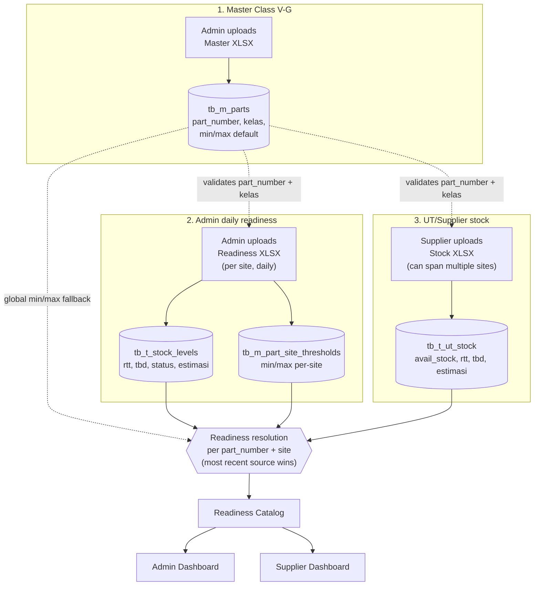

## Getting Started

### 0. Environment files (first time only)

  cp .env.prod.example .env.prod
  cp frontend/.env.local.example frontend/.env.local

  Fill in `.env.prod` — at minimum `POSTGRES_USER` / `POSTGRES_PASSWORD` / `POSTGRES_DB` /
  `DATABASE_URL` (must match the Postgres credentials) and `JWT_SECRET_KEY` (generate with
  `python -c "import secrets; print(secrets.token_hex(32))"`).

---
### Option 1: Docker (easiest — runs Postgres + backend together)

  docker compose -f docker-compose.prod.yml --env-file .env.prod up --build

  `--env-file .env.prod` is required — the compose file's `${POSTGRES_USER}` etc. placeholders
  are only substituted from that flag (there's no plain `.env` in this repo).

  This starts:
  - PostgreSQL on port 5432
  - Backend (FastAPI) on port 8000 — Alembic migrations run automatically on container start
  - Nginx on port 80 (reverse proxy in front of the API; safe to ignore for local dev)

  Seed demo data (users, sites, parts, permissions — safe to re-run):
  docker compose -f docker-compose.prod.yml exec api python scripts/seed_ut.py

  Then start the frontend separately:
  cd frontend
  npm install
  npm run dev

  Frontend will be at http://localhost:3000.

  ---
  Option 2: Run each piece manually

  1. Database — you still need Postgres running. Either via Docker:
  docker compose -f docker-compose.prod.yml --env-file .env.prod up db
  Or use a local Postgres instance with credentials matching `DATABASE_URL` in `.env.prod`
  (or `backend/app/core/config.py`'s defaults if you skip `.env.prod` entirely).

  2. Backend (FastAPI):
  cd backend
  pip install -r requirements.txt
  alembic upgrade head
  uvicorn app.main:app --host 0.0.0.0 --port 8000 --reload

  Seed demo data (optional, safe to re-run):
  python scripts/seed_ut.py

  3. Frontend (Next.js):
  cd frontend
  npm install
  npm run dev

  ---
  Ports summary:

  ┌─────────────┬────────────────────────────┐
  │   Service   │            URL             │
  ├─────────────┼────────────────────────────┤
  │ Frontend    │ http://localhost:3000      │
  ├─────────────┼────────────────────────────┤
  │ Backend API │ http://localhost:8000      │
  ├─────────────┼────────────────────────────┤
  │ API Docs    │ http://localhost:8000/docs │
  └─────────────┴────────────────────────────┘

---
## Use Case & Data Flow — Readiness

Three separate upload flows feed the same Readiness Catalog. Each has a
different role, a different required/optional column set, and a different
effect on MIN/MAX.

### 1. Master Class V/G (`can_manage_master`, admin/super_admin)

  Upload: `POST /master/parts/upload` · Template: `GET /templates/master`

  Determines which part numbers are valid at all (Class V or G) for the
  other two flows below. Required columns: `Part Number`, `Class`.
  Optional: `Stockcode`, `Description`, `Mnemonic`, `Commodity`, `Min`, `Max`.

  `Min`/`Max` here are only a **global default** (`tb_m_parts.min_qty/max_qty`).
  They matter only for a site that has never uploaded a daily readiness file
  for that part — see the override rule in section 4.

### 2. Admin daily readiness (`can_upload_admin_stock`, admin/super_admin)

  Upload: `POST /upload/admin-stock/publish` · Template: `GET /templates/readiness`

  One admin uploads this for their own site, once a day/shift. Required
  columns: `Part Number`, `Min`, `Max`, `RTT`, `TBD`, `Total` (= RTT+TBD),
  `Status` (AMAN/WARNING/OVER — trusted as-is, not recomputed), `Estimasi`.

  As a side effect, `Min`/`Max` from this file are saved per-site
  (`tb_m_part_site_thresholds`) — this **always overrides** the master's
  global default for that site once it exists.

### 3. UT/Supplier stock (`can_upload_readiness`, supplier)

  Upload: `POST /upload/ut-stock/publish` · Template: `GET /templates/ut-stock`

  One file can cover multiple sites at once — the `Plnt` column maps to a
  site via `tb_m_plant_site_mapping`, so rows for different plants land on
  different sites automatically. Required: `Material`, `Plnt`, `Avail Stock`.
  Optional: `RTT`, `TBD`, `Estimasi` — if RTT/TBD are filled in, Avail Stock
  is recomputed as RTT only (TBD stays a separate, informational figure,
  same convention as flow #2).

### 4. How readiness resolves per part+site

  Whichever of flows #2 or #3 was updated most recently for that
  (part_number, site) wins and is shown as the "source" (ADMIN/UT) in the
  Readiness Catalog. The two sources are never summed — the older one is
  just not shown until it's uploaded again more recently.

  MIN/MAX resolution: `COALESCE(per-site threshold from flow #2, global
  default from flow #1)`. Once an admin has uploaded even one daily readiness
  file for a part, the master's Min/Max for that part+site is permanently
  shadowed by the per-site value.
